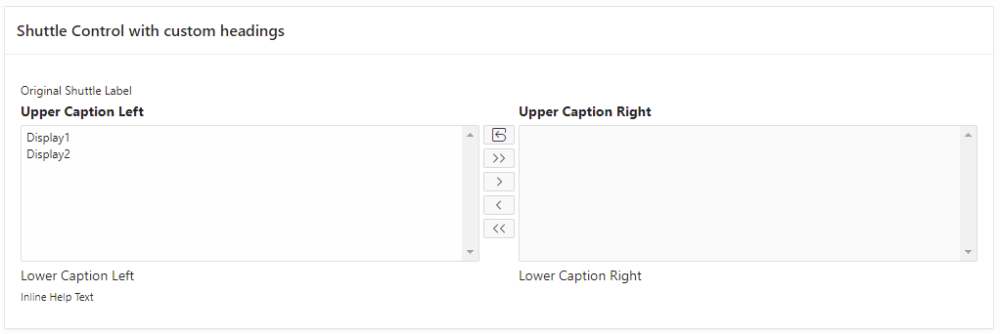
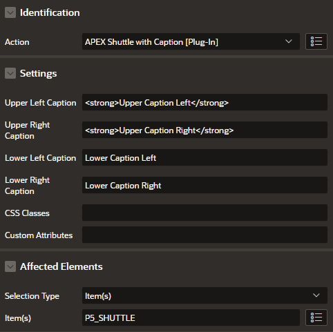

# APEX-Shuttle-with-Caption

This plug-in is used to set custom captions over/under the selection area of the APEX Shuttle Item to give the user a better explanation.

## Setup

* Create Dynamic Action on Page Load
* Selet Action "APEX Shuttle with Caption [Plug-In]"
* Set your custom captions under "Settings" 
* Select the shuttle under "Affected Elements"

